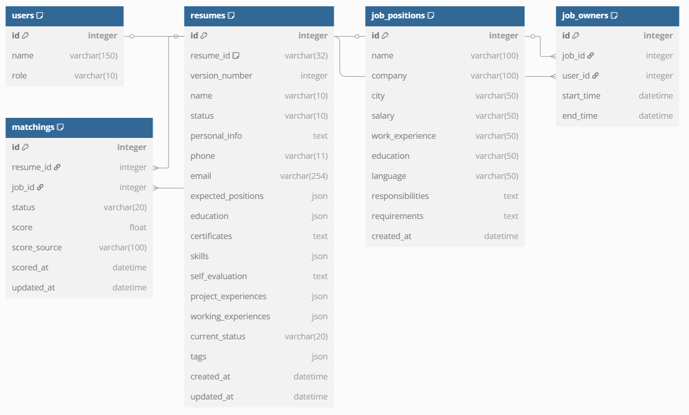

<h2 align="center"> 猎鹰 </h2>

### 表结构（待完善）


### 运行猎鹰
> [!CAUTION]
> 如果遇到表结构的问题，建议先运行表结构迁移的代码。如果还有问题可以在群里交流一下

- 在 `lieying/.env` 中修改数据库配置
- 将表结构迁移到 MySQL 数据库中
  ```bash
  python manage.py makemigrations
  python manage.py migrate
  ```
- 导入测试数据
  ```bash
  USE lieying;
  source lieying.sql;
  ```
- 创建超级管理员，并在 [127.0.0.1:8000/admin](http://127.0.0.1:8000/admin) 登录 
  ```bash
  python manage.py createsuperuser
  ```
- 启动 app
  ```bash
  python manage.py runserver
  ```

### 新建网页（功能）方法
1. 找到你要新建页面的对应app（假设为myapp），以下无特别说明均在该路径。 
2. 在 `templates/myapp` 下创建 HTML 模板，继承 `base.html`（如果需要），这里前面加一个myapp主要是为了区分，你也可以改成你喜欢的名字。
3. 在 `views.py` 中添加视图函数，注意连接到`myapp/xx.html`
4. 在 `urls.py` 的 `urlpatterns` 中注册对应路径
5. 如果`lieying/urls.py`里面没有`include("myapp.urls")`你还需添加之（更深层次，如果你没在settings注册记得先注册）。

页面之间链接跳转方式：
```html
<a href="">显示文字</a>
```